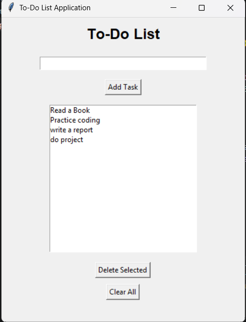

# ToDoListApp

## Description
A simple To-Do List Application developed using Python and Tkinter.

## Features
- Add Tasks
- Delete Tasks
- Clear All Tasks
- Save Tasks Automatically
- Load Saved Tasks

## Technologies Used
- Python
- Tkinter
- File Handling

## How to Run

1. Install Python.
2. Run:

python todo.py

## Screenshot

## Author
Manimela Durgarao
